Hey, I'm Eugene. I'm a Fullstack developer currently doing projects on the Fivem Platform!

More Public Projects and Website On The Way!

### What I'm Listening To Currently

### Languages

### Tools

### GitHub

